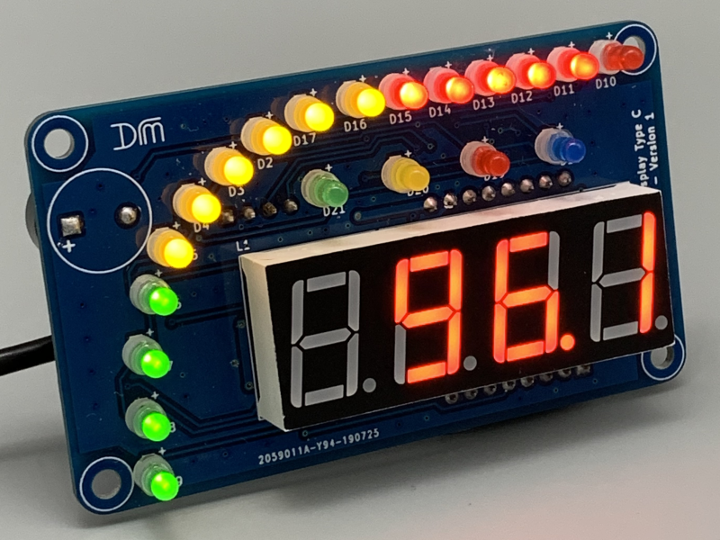
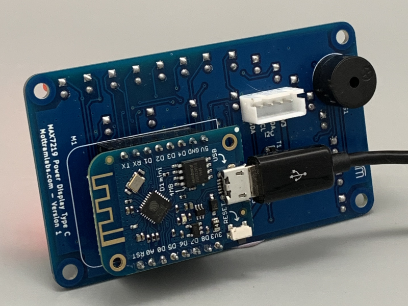
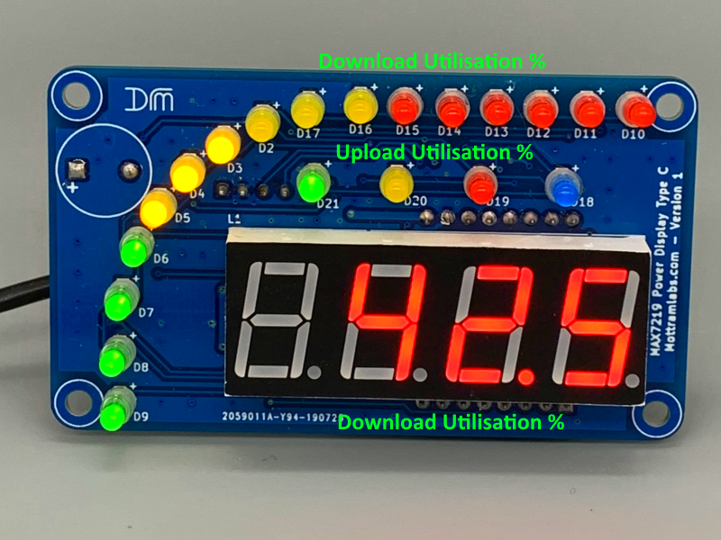

# Broadband Usage Display

This project serves to create a glanceable display to show my current broadband utilisation. Which has proved invaluable when trying to work from home and another family member starts another multi-gigabyte game update.

Requires a router which supports SNMP. I'm using a [Draytek Vigor 2860](https://amzn.to/2zIIOLe).




## What it shows



The 7-segment display and the outer 3 colour PowerBar show the download bandwidth utilisation percent. The horizontal green, yellow, red, blue LEDs are used to show the percentage upload bandwidth utilisation percent.

## Requirements

### Hardware

- Wemos D1 Mini
- USB Power supply
- MottramLabs 4 Digit Display with Bar Graph (Wemos version) [MottramLabs.com](https://www.mottramlabs.com/display_products.html)
- Router with SNMP support and ADSL-LINE-MIB
  - You could alter the OID's to query standard interfaces

### Libraries

- Data collection via SNMP: [Arduino SNMP Manager](https://github.com/shortbloke/Arduino_SNMP_Manager)
- Data polling interval control via: [MillisDelay](https://www.forward.com.au/pfod/ArduinoProgramming/TimingDelaysInArduino.html#using)
- Power Display Driver via: [MAX7219 Digits](https://github.com/Mottramlabs/MAX7219-7-Segment-Driver)

## Configuration

### Automatic Speed Detection

For ADSL/VDSL connections the line sync speed can be read via SNMP for some routers and this provide the maximum upload and download speeds currently possible. The [broadbandspeed.ino](broadbandspeed.ino) example uses this method, assuming the interface index 4 represents the DSL interface on the router. You may need to update the last number of the OIDs to change the interface being monitored.

```cpp
const char *oidAdslDownSpeed = ".1.3.6.1.2.1.10.94.1.1.4.1.2.4"; // Guage ADSL Down Sync Speed
const char *oidAdslUpSpeed = ".1.3.6.1.2.1.10.94.1.1.5.1.2.4";   // Guage ADSL Up Sync Speed
const char *oidInOctets = ".1.3.6.1.2.1.2.2.1.10.4";             // Counter32 ifInOctets.4
const char *oidOutOctets = ".1.3.6.1.2.1.2.2.1.16.4";            // Counter32 ifOutOctets.4
const char *oidUptime = ".1.3.6.1.2.1.1.3.0";                    // TimeTicks Uptime
```

### Fixed/Hardcoded Speeds

If the router doesn't provide line sync speeds, or the router is using a cable or other connection. You can set fixed upload and download speeds instead, this is shown the in the [broadbandspeed_FixedSpeeds.ino](broadbandspeed_FixedSpeeds.ino) example by changing the lines:

```cpp
const unsigned int downSpeed = 516000000;       // 516Mbps
const unsigned int upSpeed = 36000000;          // 36Mbps
```

### General Configuration

Before flashing your Wemos, edit the sketch and set:

- `ssid` and `password` with your WiFi connection information
- `IPAddress router(192, 168, 200, 1);` replace with the IP address of your router
- `community` the SNMP community string of your router
- `pollInterval` controls how frequently data is requested from the router. Default is 15 second.

There are lots of other configurable parameters, as you'll see if you look through the code. Hopefully the names and comments make it easy enough to understand.
