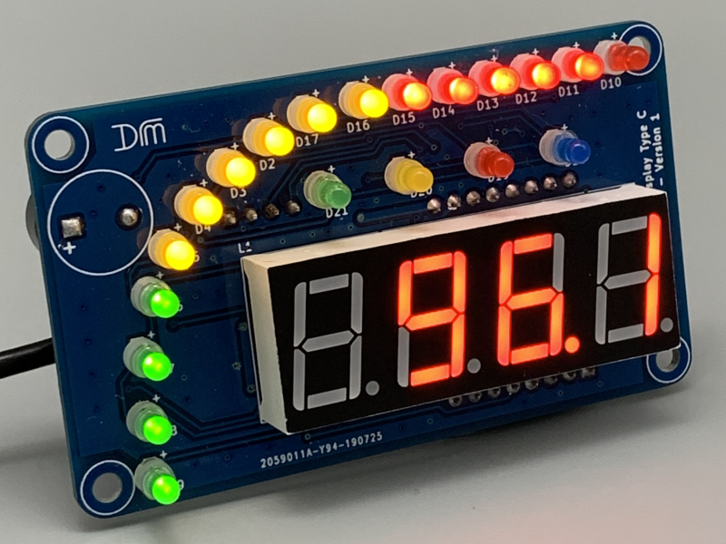
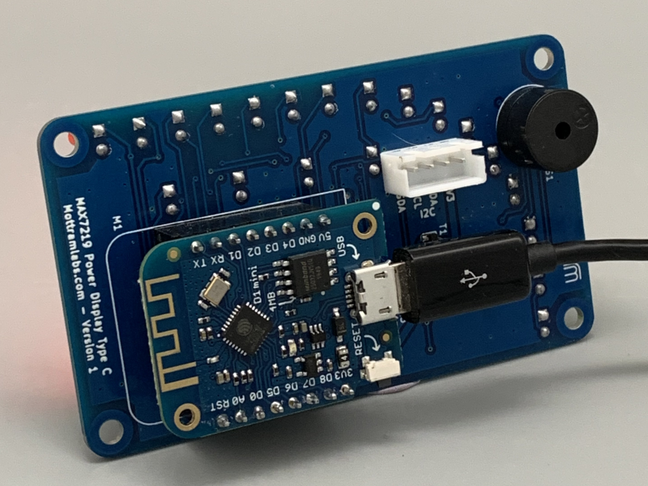
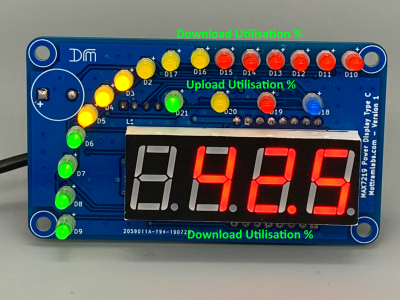

# Broadband Usage Display

This project serves to create a glanceable display to show my current broadband utilisation. Which has proved invaluable when trying to work from home and another family member starts another multi-gigabyte game update.

Requires a network device which supports SNMP. A router, firewall, managed
switch, server, NAS, or printer can be used when it exposes the required MIB
values. I'm using a [Draytek Vigor 2860](https://amzn.to/2zIIOLe).




## What it shows



The 7-segment display and the outer 3 colour PowerBar show the download bandwidth utilisation percent. The horizontal green, yellow, red, blue LEDs are used to show the percentage upload bandwidth utilisation percent.

The display shows **utilisation**, which is the percentage of a connection's
available speed currently being used. For example, 50% of a 100 Mbps download
connection means approximately 50 Mbps is being received.

### A few words explained

- **SNMP** is a standard way for one device to ask another device for status information. The display controller asks the network device for traffic counters; it does not control that device.
- An **SNMP community** is like a read-only password. `public` is only an example and may not be enabled on your network device.
- An **interface index** identifies a port or logical connection. It is not always the same as the port number printed on the device. Use the index shown by the device's SNMP interface table.
- A **bit** is a single 0 or 1. A **byte** is 8 bits. Internet connection speeds are normally written in **bits per second**, such as `100 Mbps`.
- `Mbps` means megabits per second. `MB/s` means megabytes per second. They are different: `100 Mbps` is approximately `12.5 MB/s` before protocol overhead because $8$ bits make one byte.
- The speed values in this project must be entered in **bits per second**, not bytes per second. Therefore `1 Gbps` is written as `1000000000`, and `100 Mbps` is written as `100000000`.

## PlatformIO

The checked-in PlatformIO configuration targets an ESP8266-based Wemos D1 Mini
because that is the controller supported by the display PCB. The display and
SNMP concepts are not specific to that board, so the sketches can be adapted
to another compatible ESP device if the hardware connections and PlatformIO
board configuration are changed.

The default environment builds the automatic speed-detection sketch:

```sh
pio run -e automatic
pio run -e automatic -t upload
```

To build or upload the fixed-speed variant instead:

```sh
pio run -e fixed-speeds
pio run -e fixed-speeds -t upload
```

Set the Wi-Fi and network-device values in the local secrets header before uploading.

This project uses the published SNMP Manager 2.x package from the PlatformIO
Registry. The sketches use the 2.x named SNMP version and fixed-width counter
types described in the library's [migration guide](https://github.com/shortbloke/Arduino_SNMP_Manager/blob/main/MIGRATION.md).

Use the normal package manager for your build tool. Do not add a GitHub URL or
Git tag for SNMP Manager; the published 2.x package is the supported source.

For Arduino IDE, install **SNMP Manager 2.x** from **Tools > Manage Libraries**.
For Arduino CLI, install the published package with:

```sh
arduino-cli lib install "SNMP Manager@2.0.0"
```

For a PlatformIO project, the dependency entry is:

```ini
lib_deps =
  shortbloke/SNMP Manager@^2.0.0
```

Do not use the older 1.x example `shortbloke/SNMP Manager@^1.2.1` with these
sketches. It refers to the previous API and does not provide the Counter64 and
other 2.x interfaces used here.

### Optional SNMP library build flags

You may see examples in the SNMP Manager migration guide such as:

```ini
build_flags =
  -DSNMP_PACKET_LENGTH=1024
  -DSNMP_MAX_PENDING_REQUESTS=8
  -DDEBUG
```

Those are optional library-wide tuning and diagnostic settings. This project
does not currently need them: it uses the library defaults, sends a small
request for one selected interface, and already checks request-building and
send failures. Do not add these flags just because they appear in the library
documentation. If you do add one, place it under the shared `[env]` section in
`platformio.ini` so the application and the compiled SNMP library receive the
same setting.

## Requirements

### Hardware for this PCB

- ESP8266-based Wemos D1 Mini controller
- USB Power supply
- MottramLabs 4 Digit Display with Bar Graph (Wemos version) [MottramLabs.com](https://www.mottramlabs.com/display_products.html)
- Network device with SNMP support
  - Automatic mode requires the device's ADSL-LINE-MIB values
  - Fixed-speed mode requires standard IF-MIB interface counters

The controller is the board-specific part of this project. The SNMP device can
be a router, firewall, managed switch, server, NAS, printer, or another device
that exposes the required standard MIB values.

### Libraries

- Data collection via SNMP: published **SNMP Manager 2.x** library ([GitHub project](https://github.com/shortbloke/Arduino_SNMP_Manager))
- Data polling interval control via: [MillisDelay](https://www.forward.com.au/pfod/ArduinoProgramming/TimingDelaysInArduino.html#using)
- Power Display Driver via: [MAX7219 Digits](https://github.com/Mottramlabs/MAX7219-7-Segment-Driver)

## Configuration

### Quick start

1. Copy `include/project_secrets.h.example` to `include/project_secrets.h`.
2. Enter your Wi-Fi name, Wi-Fi password, network-device IP address, interface index,
   and SNMP community in the new local file.
3. Choose `automatic` or `fixed-speeds` in PlatformIO.
4. Build and upload the selected environment.
5. Open the serial monitor at `115200` baud if the display does not show data.

The real secrets file is ignored by Git. Never paste your Wi-Fi password or a
private SNMP community into the `.ino` files or commit it to GitHub.

### What you need to edit

For normal setup, edit only `include/project_secrets.h` and, for fixed-speed
mode, the two speed values in `broadbandspeed_FixedSpeeds.ino`:

- You **do** edit your Wi-Fi name and password.
- You **do** edit the network-device IP address, community, and interface index.
- You **do** edit the download and upload speeds when using fixed-speed mode.
- You **do not** edit the numeric OIDs unless your device uses a different MIB.
- You **do not** need to understand the SNMP library classes to use the project.

The code has two layers. The configuration layer contains values that vary from
one installation to another. The SNMP layer asks for standard traffic values
using those settings. Keeping these layers separate means changing a switch
port or network device does not require rewriting the polling logic.

### How one reading becomes a display value

1. The controller connects to Wi-Fi.
2. It asks the configured network device for the selected interface's cumulative byte counters and uptime.
3. It waits, then asks again.
4. It calculates how many bytes arrived or left during that interval.
5. It converts bytes to bits, compares the result with the configured speed, and calculates a percentage.
6. It sends that percentage to the display.

The words “MIB name”, “numeric OID”, and “interface index” describe the same
request at different levels. The MIB name is the human-friendly label, the
numeric OID is what SNMP sends, and the interface index selects the port. You
normally only choose the interface index; the project supplies the standard
numeric OID bases.

### Automatic Speed Detection

For ADSL/VDSL connections, some routers report the negotiated line speed via
SNMP. The [broadbandspeed.ino](broadbandspeed.ino) example uses those values as
the available download and upload speeds. This mode only works when the router
provides the ADSL/VDSL OIDs shown below. Set `routerInterfaceIndex` to the DSL
interface index on the router.

```cpp
const char *oidAdslDownSpeed = ".1.3.6.1.2.1.10.94.1.1.4.1.2.4"; // Gauge ADSL Down Sync Speed
const char *oidAdslUpSpeed = ".1.3.6.1.2.1.10.94.1.1.5.1.2.4";   // Gauge ADSL Up Sync Speed
const char *oidInOctets = ".1.3.6.1.2.1.31.1.1.1.6.4";          // IF-MIB::ifHCInOctets.4
const char *oidOutOctets = ".1.3.6.1.2.1.31.1.1.1.10.4";       // IF-MIB::ifHCOutOctets.4
const char *oidUptime = ".1.3.6.1.2.1.1.3.0";                    // TimeTicks Uptime
```

### Fixed/Hardcoded Speeds

If the router does not provide line sync speeds, use the
[broadbandspeed_FixedSpeeds.ino](broadbandspeed_FixedSpeeds.ino) example. Set
the actual broadband plan speeds, not necessarily the Ethernet port speed.
Both sketches use the high-capacity `ifHCInOctets` and `ifHCOutOctets`
Counter64 values, which are important for links above 1 Gbps.

```cpp
const unsigned int downSpeed = 516000000;       // 516,000,000 bits/s = 516 Mbps
const unsigned int upSpeed = 36000000;          // 36,000,000 bits/s = 36 Mbps
```

To convert a plan advertised in Mbps, multiply by `1,000,000`:

| Advertised speed | Value to enter |
| --- | ---: |
| 100 Mbps | `100000000` |
| 516 Mbps | `516000000` |
| 1 Gbps / 1,000 Mbps | `1000000000` |
| 2.5 Gbps / 2,500 Mbps | `2500000000` |

Do not enter a speed-test result labelled `MB/s` directly. Multiply it by 8
first, then convert to bits per second. For example, `50 MB/s` is approximately
`400 Mbps`, so enter `400000000`.

### General Configuration

Before flashing your ESP controller, copy `include/project_secrets.h.example` to
`include/project_secrets.h` and set:

- `ssid` and `password` with your WiFi connection information
- `routerAddress` with the network device's dotted IPv4 address, for example `"192.168.0.1"`
- `routerInterfaceIndex` with the interface index used by the OIDs. This might be `2` for a 2.5 Gbps switch port even if the port is physically labelled something else.
- `community` the SNMP community string of your router
- `pollInterval` controls how frequently data is requested from the router. The value is in milliseconds; `15000` means 15 seconds.

`include/project_secrets.h` is ignored by Git, so your Wi-Fi and SNMP
credentials stay local. The sketches fall back to the redacted example when
that file is absent.

### Finding the interface index

If you do not know the index, use an SNMP browser or command-line tool to read
the network device's interface description table. Look for the interface carrying the
traffic you want to measure, then use the number at the end of its SNMP OID.
For example, an entry ending in `.2` has interface index `2`.

The standard traffic objects used by this project are:

- `ifHCInOctets`: total bytes received by the interface
- `ifHCOutOctets`: total bytes transmitted by the interface
- `sysUpTime`: how long the SNMP device has been running

The code uses the standard MIB names as labels, but sends numeric OIDs to the
device. For reference:

| MIB name | Numeric OID base | Meaning |
| --- | --- | --- |
| `IF-MIB::ifHCInOctets` | `.1.3.6.1.2.1.31.1.1.1.6` | Bytes received |
| `IF-MIB::ifHCOutOctets` | `.1.3.6.1.2.1.31.1.1.1.10` | Bytes transmitted |
| `SNMPv2-MIB::sysUpTime` | `.1.3.6.1.2.1.1.3.0` | Device uptime |

The interface index is appended to the two interface OIDs. For example,
`IF-MIB::ifHCInOctets.2` becomes
`.1.3.6.1.2.1.31.1.1.1.6.2`. A full MIB parser is deliberately not included
on the controller because these small numeric mappings use much less memory.

These are cumulative byte counters. The firmware compares two readings over
time, converts the byte difference to bits, and calculates a percentage from
the configured connection speed. You should not interpret the raw counter
number itself as a current speed.

If the configured device address is invalid or SNMP is disabled, the controller
cannot automatically guess another device. Set `routerAddress` to the device
that should be queried and make sure UDP port 161 and the configured community
are allowed from the controller's network.
